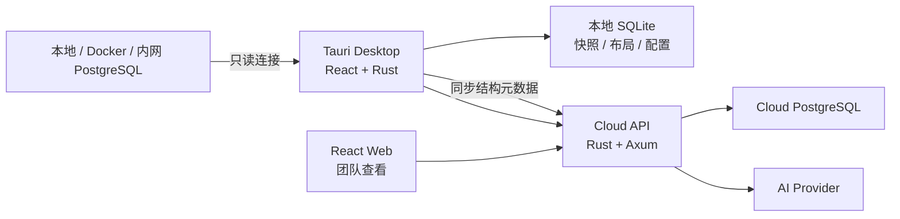

# Nodal Studio 开发方案

> 文档状态：Draft v1  
> 产品形态：Local-first, Cloud-synced  
> 首期数据库：PostgreSQL  
> 核心技术：Rust + React + Tauri

## 1. 背景与产品初衷

AI 编程工具正在快速生成代码、数据库表、ORM 模型和 Migration。工程师虽然获得了更高的开发速度，却越来越难持续理解整个数据库模型：有哪些业务模块、表之间为什么关联、最近发生了什么变化，以及一次 AI 生成的修改会影响哪些已有结构。

传统 SQLEditor 的主要工作流是“先设计 ER 模型，再生成数据库”。Nodal Studio 采用相反的工作流：

```text
连接真实数据库
→ 自动映射当前 Schema
→ 生成可探索的 ER 模型
→ 持续记录模型快照与变化
→ 帮助工程师和新成员理解系统
```

Nodal Studio 的核心价值不是替代数据库设计工具，而是让数据库模型始终可见、可理解、可追踪。

## 2. 已确定的产品结论

### 2.1 产品定位

Nodal Studio 是开发期间持续连接数据库、自动生成 ER 模型并记录 Schema 演进历史的可视化数据模型工具。

一句话定义：

> 数据库模型的实时地图与时间机器。

### 2.2 核心使用场景

1. **开发期间持续查看模型**：工程师或 AI 修改数据库后，自动看到新增、修改和删除的表、字段、索引、约束与关系。
2. **新人理解已有系统**：通过业务分组、搜索、关系导航和 AI 解释快速熟悉数据库结构。
3. **回顾模型演进历史**：比较任意两个时间点的 Schema，理解某次修改的内容和影响。
4. **团队共享数据库认知**：开发者从本地数据库采集结构，其他成员通过 Web 查看同步后的模型，而不需要数据库凭据。

### 2.3 核心产品边界

第一阶段采用 **Read-first** 原则：

- 数据库是物理模型的唯一事实来源。
- Nodal Studio 使用只读连接反向生成模型。
- 第一版不在画布上修改数据库，不执行 DDL。
- 用户可编辑的是语义层：布局、业务分组、标签、注释和核心表标记。
- 不读取或上传表中的业务数据。

### 2.4 产品形态

采用 **Tauri 桌面端 + Web 查看端 + 可选云同步**：

- 开发者使用 Tauri 桌面端直接连接 localhost、Docker、VPN、VPC 或公司内网数据库。
- 桌面端本地生成 Snapshot、ChangeSet 和 ER 模型，可完全离线使用。
- 登录后可将脱敏的结构元数据同步到云端。
- 新人和其他团队成员通过 Web 版本查看模型、历史和 AI 解释。
- React 前端在桌面端与 Web 端复用，平台能力通过统一接口隔离。

## 3. 目标与非目标

### 3.1 MVP 目标

- 支持 PostgreSQL 只读连接。
- 自动读取 Schema、表、字段、主键、外键、索引、唯一约束、检查约束、枚举和注释。
- 生成可缩放、搜索、过滤和重新布局的 ER 图。
- 保存本地 Schema Snapshot。
- 自动检测 Schema 变化并生成结构化 ChangeSet。
- 提供模型变化时间线和任意版本对比。
- 保存独立于物理模型的布局和语义标注。
- 为后续 AI 解释、云同步和多数据库适配建立稳定接口。

### 3.2 MVP 非目标

- 不做 SQL 查询编辑器和数据浏览器。
- 不执行 `CREATE`、`ALTER`、`DROP` 等 DDL。
- 不替代 pgAdmin、DBeaver 等数据库管理工具。
- 不在第一版同时支持 MySQL、SQLite、SQL Server 和 Oracle。
- 不做多人实时共同拖动画布。
- 不上传表数据、字段样本或查询结果。
- 不在第一版实现完整代码血缘和 API 血缘。

## 4. 总体架构



架构分为三层：

1. **采集层**：Rust 数据库适配器连接目标数据库并生成标准化 Schema。
2. **模型层**：负责 Snapshot、Diff、ChangeSet、布局和语义标注。
3. **展示层**：React 提供 ER 图、变化时间线、搜索、详情和 AI 交互。

## 5. 技术选型

### 5.1 前端

| 能力 | 选型 | 用途 |
|---|---|---|
| UI 框架 | React + TypeScript | 桌面与 Web 共用界面 |
| 构建工具 | Vite | 同时输出 Web 和 Tauri 静态资源 |
| 路由 | TanStack Router | 类型安全的 SPA 路由 |
| ER 画布 | React Flow (`@xyflow/react`) | 表节点、外键边、分组和交互 |
| 自动布局 | ELK.js | 大型关系图布局与减少连线交叉 |
| 本地 UI 状态 | Zustand | 选择、缩放、过滤、草稿布局 |
| 服务端状态 | TanStack Query | Snapshot、ChangeSet、同步状态缓存 |
| 样式 | Tailwind CSS + shadcn/ui | 构建现代桌面工具界面 |
| 测试 | Vitest + React Testing Library | 组件和前端逻辑测试 |
| E2E | Playwright | 连接、生成模型、版本比较流程测试 |

ELK 布局计算需要放入 Web Worker，避免大型 Schema 阻塞 UI 主线程。

### 5.2 Rust 桌面端与核心层

| 能力 | 选型 | 用途 |
|---|---|---|
| 桌面框架 | Tauri 2 | macOS、Windows、Linux 桌面外壳 |
| 异步运行时 | Tokio | 数据库、文件和网络异步任务 |
| 数据库访问 | SQLx | PostgreSQL introspection 与本地 SQLite |
| 序列化 | Serde + serde_json | Rust、React、云端统一协议 |
| 本地存储 | SQLite | Snapshot、ChangeSet、布局和同步队列 |
| 凭据保存 | OS Keychain | 保存数据库密码或 Token |
| 日志 | tracing + tracing-subscriber | 结构化日志和诊断 |
| 错误模型 | thiserror | 稳定的领域错误类型 |
| HTTP 客户端 | reqwest | 桌面端云同步与 AI 请求 |

数据库凭据不得保存在 SQLite 明文字段中。SQLite 只保存 Keychain 引用和非敏感连接信息。

### 5.3 云端服务

| 能力 | 选型 | 用途 |
|---|---|---|
| Web 服务 | Axum | 项目、快照、权限、同步和 AI API |
| 异步运行时 | Tokio | 网络与后台任务 |
| 元数据数据库 | PostgreSQL | 团队、项目、快照和审计记录 |
| 数据访问 | SQLx | 云端元数据访问 |
| API 描述 | OpenAPI | Web 客户端和接口调试 |
| 实时通知 | SSE | 同步完成、模型更新等单向事件 |
| 可观测性 | tracing + OpenTelemetry | 日志、指标和调用链 |

云端服务在桌面 MVP 验证完成后开发，不阻塞第一阶段交付。

### 5.4 工程工具

- Rust stable toolchain，提交 `Cargo.lock` 保证应用构建可复现。
- Node.js 24 LTS。
- pnpm workspace 管理前端包。
- Cargo workspace 管理 Rust crates。
- ESLint、Prettier、`cargo fmt`、Clippy 作为基础质量门禁。
- Docker Compose 提供测试 PostgreSQL 和后续云端开发环境。

## 6. 代码仓库规划

```text
NodalStudio/
├── apps/
│   ├── frontend/                 # React，桌面与 Web 共用
│   ├── desktop/
│   │   └── src-tauri/            # Tauri 命令、状态与权限
│   └── cloud-api/                # Axum 云端服务（后续阶段）
│
├── crates/
│   ├── schema-model/             # 与数据库无关的统一模型
│   ├── postgres-adapter/         # PostgreSQL introspection
│   ├── schema-diff/              # Snapshot Diff 与 ChangeSet
│   ├── snapshot-store/           # SQLite/Cloud 存储抽象
│   ├── sync-protocol/            # 桌面与云端同步协议
│   └── ai-context/               # AI 上下文选择与压缩
│
├── packages/
│   ├── ui/                       # 通用 React UI
│   ├── graph/                    # Schema → React Flow 转换
│   └── platform/                 # Tauri/Web 平台调用抽象
│
├── fixtures/                     # PostgreSQL Schema 测试样本
├── infrastructure/               # Docker 与部署配置
└── docs/                         # 架构与产品文档
```

`schema-model`、`schema-diff` 和 `postgres-adapter` 不得依赖 Tauri 或 React，以便在桌面端、云端和测试程序中复用。

## 7. 核心领域模型

### 7.1 物理模型

```rust
pub struct DatabaseSnapshot {
    pub id: SnapshotId,
    pub source_id: DataSourceId,
    pub captured_at: DateTime<Utc>,
    pub fingerprint: String,
    pub schemas: Vec<SchemaDefinition>,
}

pub struct SchemaDefinition {
    pub name: String,
    pub tables: Vec<TableDefinition>,
    pub views: Vec<ViewDefinition>,
    pub enums: Vec<EnumDefinition>,
}

pub struct TableDefinition {
    pub stable_key: ObjectKey,
    pub schema: String,
    pub name: String,
    pub columns: Vec<ColumnDefinition>,
    pub primary_key: Option<PrimaryKeyDefinition>,
    pub foreign_keys: Vec<ForeignKeyDefinition>,
    pub indexes: Vec<IndexDefinition>,
    pub constraints: Vec<ConstraintDefinition>,
    pub comment: Option<String>,
}
```

所有集合在计算 fingerprint 前必须规范化排序，避免数据库返回顺序变化产生虚假 Diff。

### 7.2 变化模型

```rust
pub struct SchemaChangeSet {
    pub id: ChangeSetId,
    pub before_snapshot_id: SnapshotId,
    pub after_snapshot_id: SnapshotId,
    pub created_at: DateTime<Utc>,
    pub operations: Vec<SchemaOperation>,
    pub risk_summary: RiskSummary,
}

pub enum SchemaOperation {
    AddTable,
    DropTable,
    RenameTable,
    AddColumn,
    DropColumn,
    RenameColumn,
    AlterColumn,
    AddForeignKey,
    DropForeignKey,
    AddIndex,
    DropIndex,
    AddConstraint,
    DropConstraint,
}
```

第一版对 Rename 采用“候选建议 + 用户确认”，避免把删除和新增错误识别为重命名。

### 7.3 语义模型

语义模型与数据库物理模型分开保存：

- `CanvasLayout`：节点位置、缩放、折叠状态。
- `DomainGroup`：用户、订单、支付等业务分组。
- `ObjectAnnotation`：说明、标签、负责人、核心程度。
- `SavedView`：特定模块或关系范围的保存视图。

物理模型更新时，通过 `ObjectKey` 将仍存在的对象重新关联到已有语义信息。

## 8. 平台抽象

React 组件不能直接调用 Tauri `invoke()`，否则无法构建独立 Web 版本。前端统一依赖平台接口：

```ts
export interface NodalStudioPlatform {
  listDataSources(): Promise<DataSource[]>;
  testConnection(input: ConnectionInput): Promise<ConnectionResult>;
  captureSnapshot(sourceId: string): Promise<DatabaseSnapshot>;
  listSnapshots(projectId: string): Promise<SnapshotSummary[]>;
  compareSnapshots(beforeId: string, afterId: string): Promise<SchemaChangeSet>;
  saveLayout(input: SaveLayoutInput): Promise<void>;
}
```

实现分为：

- `TauriPlatform`：通过 `invoke()` 调用本机 Rust。
- `WebPlatform`：通过 HTTPS 调用 Axum API。
- `MockPlatform`：用于 Storybook、组件测试和演示数据。

React 页面只依赖 `NodalStudioPlatform`，不感知运行环境。

## 9. PostgreSQL 采集方案

### 9.1 读取范围

结合 `information_schema` 与 `pg_catalog` 读取：

- Schema、普通表、分区表和视图。
- 字段顺序、类型、长度、精度、默认值、Nullable。
- 主键、唯一约束、检查约束和外键。
- 普通索引、唯一索引、部分索引和表达式索引。
- 枚举、序列、Identity、Generated Column。
- 表和字段注释。

首期明确支持 PostgreSQL 14 及以上版本，并用集成测试覆盖多个主要版本。

### 9.2 变化检测

MVP 使用 Snapshot Fingerprint：

```text
手动刷新或定时检查
→ 读取轻量结构指纹
→ 指纹未变化：结束
→ 指纹变化：完整 introspection
→ 保存新 Snapshot
→ 与上一 Snapshot 生成 ChangeSet
→ 更新 ER 图和变化时间线
```

默认检测间隔建议为 30 秒，可关闭或调整。数据库 Event Trigger 只作为后续可选增强，不要求用户在数据库内安装对象或授予高权限。

### 9.3 权限原则

- 推荐使用单独的只读数据库账号。
- 连接测试需要明确显示 SSL 状态和数据库版本。
- 所有采集 SQL 必须由内置模板生成，不接受任意前端 SQL。
- 设置连接、查询和整体采集超时。
- 日志中隐藏密码、Token 和完整连接串。

## 10. ER 图与交互设计

### 10.1 页面结构

```text
┌──────────────────────────────────────────────────────────────┐
│ 项目 / 数据源 / 环境   搜索   当前版本 / 历史版本   同步状态 │
├──────────────┬──────────────────────────────┬────────────────┤
│ Schema       │                              │ 表与字段详情   │
│ 业务模块     │          ER 模型画布         │ 关系与注释     │
│ 保存视图     │                              │ AI 解释        │
│              │                              │                │
│ 变化时间线   │                              │                │
├──────────────┴──────────────────────────────┴────────────────┤
│ 最近变化：+1 表  +4 字段  ~2 索引          查看完整 Diff    │
└──────────────────────────────────────────────────────────────┘
```

### 10.2 三种查看模式

1. **Explore**：查看当前数据库模型。
2. **Changes**：在当前画布上高亮某个 ChangeSet。
3. **History**：选择两个 Snapshot 进行对比或回到历史模型。

### 10.3 大型模型性能策略

- 根据缩放等级切换节点细节，远距离只显示表名和关系数量。
- 支持折叠字段、隐藏无关表、仅查看 N 跳邻居。
- 按 Schema 或业务模块分组。
- ELK 布局在 Web Worker 中执行。
- 缓存布局结果，结构未变化时不重新布局。
- 首期性能目标：500 张表、5,000 个字段仍可进行平移、缩放和搜索。

## 11. Snapshot、Diff 与历史

### 11.1 Snapshot 策略

- 第一次连接成功后建立 Baseline Snapshot。
- 仅在 fingerprint 改变时保存新 Snapshot。
- Snapshot 为不可变记录。
- ChangeSet 始终引用确定的 before/after Snapshot。
- 定期压缩重复的展示数据，但不破坏历史引用。

### 11.2 ChangeSet 展示

颜色语义：

- 绿色：新增。
- 黄色：修改。
- 红色：删除。
- 蓝色：关系或位置变化提示。

风险标记：

- 删除表或字段：高风险。
- 字段类型缩窄、Nullable 变为 Not Null：高风险。
- 删除外键、唯一约束或关键索引：中高风险。
- 新增表、字段、索引：普通变化。

风险标记是结构提示，不替代 DBA 对实际数据规模和执行计划的判断。

## 12. AI 能力规划

AI 放在基础模型稳定之后接入。第一阶段 AI 只读，不生成或执行 DDL。

优先能力：

1. 解释某张表、字段或关系可能承担的业务职责。
2. 总结一个业务模块的核心表和上下游关系。
3. 总结某个 ChangeSet 修改了什么及潜在影响。
4. 根据自然语言定位相关表，例如“支付失败记录在哪里”。
5. 为缺少注释的对象生成候选说明，由用户确认后保存到语义层。

上下文策略：

```text
用户问题
→ 定位相关对象
→ 扩展一至两层关系邻居
→ 加入约束、索引、注释和近期变化
→ 生成紧凑 Schema Context
→ 调用模型
```

默认不把完整大型 Schema 一次性发送给模型，也不发送数据库业务数据。

## 13. 本地与云端同步

### 13.1 同步内容

允许同步：

- 规范化 Schema Snapshot。
- ChangeSet 和风险摘要。
- 布局、业务分组、标签和注释。
- 数据源显示名称、数据库类型和版本。

禁止同步：

- 数据库密码和完整连接串。
- 表中的业务行数据。
- 字段样本、查询结果和日志中的敏感值。
- 未经用户确认的本地文件内容。

### 13.2 同步原则

- 本地优先，离线操作写入 SQLite 同步队列。
- 网络恢复后按幂等事件上传。
- Snapshot 内容寻址，使用 hash 去重。
- 布局和注释采用版本号进行乐观并发控制。
- 云端删除项目不能自动删除本地历史，需二次确认。

### 13.3 Git 协作工作区

- `.nodalmodel` 仅作为备份和离线传输格式，不作为多人共同修改的 Git 文件。
- Git 中的物理结构事实来源保持为 Migration、DDL 和 ORM；Snapshot 是可重新生成的派生产物。
- 可导出拆分的 `.nodalstudio/` 目录：按对象保存语义信息，按稳定 ID 保存业务域、视图和变更证据。
- Snapshot 内容、布局坐标、凭据、Token、本地 source ID、采集时间和业务行数据不进入 Git 工作区。
- 语义 JSON 使用稳定排序和确定性序列化，避免无意义 Diff。
- 提供语义三方合并：不同对象或字段自动合并，标签集合合并，同一标量冲突输出结构化报告。
- Git 合并后可显式导入语义、业务域、关系视图、变更证据和代码血缘；导入不覆盖 Snapshot、连接或布局。
- 导入时对比工作区与本地最新 Snapshot 指纹，不匹配时明确提示刷新数据库并复核对象引用。
- 个人布局仅保存在本地；共享布局通过云端版本控制；默认布局根据规则重新计算。

## 14. 安全设计

- Tauri 前端使用随应用打包的静态资源，不加载带本地权限的远程页面。
- Tauri Capability 采用最小权限配置。
- React 只能调用预定义 Rust Command。
- Rust Command 对参数进行完整校验，不接受任意 SQL。
- 数据库凭据保存在操作系统 Keychain。
- 云端通信强制 HTTPS，Token 使用短期访问令牌和可撤销刷新令牌。
- Snapshot 上传前经过字段级白名单序列化。
- 提供“完全离线模式”，用户可永久关闭云同步和 AI。
- 所有同步、登录和 AI 操作写入审计日志。

## 15. 开发阶段与里程碑

### 阶段 0：工程骨架

交付内容：

- 初始化 Cargo workspace 与 pnpm workspace。
- 创建 React + Vite + Tauri 2 应用。
- 建立 `schema-model`、`postgres-adapter`、`schema-diff` crates。
- 建立 `platform`、`graph`、`ui` packages。
- 配置格式化、Lint、单元测试和基础 CI。

验收标准：

- 桌面应用可启动。
- Web 构建可独立运行。
- React 可通过平台接口调用一个示例 Tauri Command。

### 阶段 1：PostgreSQL Introspection

交付内容：

- 数据库连接配置和 Keychain 存储。
- PostgreSQL 连接测试。
- 完整读取 MVP 范围内的 Schema 对象。
- 规范化模型、稳定 ObjectKey 和 fingerprint。
- 使用 Docker PostgreSQL fixtures 建立黄金测试。

验收标准：

- 对同一结构重复采集生成相同 fingerprint。
- 能正确识别复合主键、复合外键、唯一约束和常用索引。
- 采集过程不读取用户表中的行数据。

### 阶段 2：ER Explorer

交付内容：

- Schema 树、表节点、字段和外键连线。
- 搜索、过滤、缩放、框选和关系导航。
- ELK 自动布局及布局持久化。
- 表、字段、约束和索引详情面板。
- Explore 模式。

验收标准：

- 用户连接数据库后可在一分钟内看到第一张 ER 图。
- 500 张表的测试模型能够完成布局并保持基本交互流畅。
- 重启应用后恢复用户调整的布局。

### 阶段 3：Snapshot 与 Schema History

交付内容：

- SQLite Snapshot Store。
- 手动刷新和后台变化检测。
- Schema Diff 与 ChangeSet。
- Changes 和 History 模式。
- 时间线、版本选择和变化高亮。

验收标准：

- 增删改表、字段、索引和外键后能生成正确 ChangeSet。
- 可以比较任意两个 Snapshot。
- 删除类变化明确标记为高风险。

### 阶段 4：语义模型与新人探索

交付内容：

- 业务模块分组、标签、注释和核心表标记。
- 保存视图和 N 跳关系视图。
- 模块概览页。
- 物理模型更新后的语义信息重关联。

验收标准：

- 用户可以建立“订单”“支付”等业务模块。
- 数据库刷新后，未被删除对象的语义信息和位置不会丢失。

### 阶段 5：AI 解释

交付内容：

- AI Provider 抽象。
- 表、模块和 ChangeSet 解释。
- 基于图邻域的上下文选择。
- AI 候选注释确认流程。
- 完全关闭 AI 的隐私选项。

验收标准：

- AI 请求中不包含数据库凭据和业务行数据。
- 大型 Schema 问题不会默认发送完整模型。
- AI 生成的说明必须经用户确认才能写入语义层。

### 阶段 6：Cloud Sync 与 Web 查看端

交付内容：

- Axum Cloud API 和云端 PostgreSQL。
- 账号、团队、项目和只读分享权限。
- Snapshot、ChangeSet 和语义信息同步。
- WebPlatform 和独立 Web 部署。
- 离线队列、冲突检测和审计记录。

验收标准：

- 开发者从 Tauri 同步模型后，新成员可通过浏览器查看。
- Web 用户不需要目标数据库凭据。
- 云端不可获得本地数据库密码和业务数据。

### 阶段 7：扩展能力

- Git/Migration 关联，将 ChangeSet 关联到 branch、commit 和 PR。
- 开发、测试、生产环境之间的 Schema Drift 对比。
- MySQL 适配器。
- 代码和 ORM 模型血缘。
- 可选数据库 Event Trigger 增强。
- 企业私有化部署。

## 16. 测试策略

### 16.1 Rust 单元测试

- 每种 Schema 对象的序列化与规范化。
- fingerprint 稳定性。
- 每种 `SchemaOperation` 的 Diff。
- Rename 候选和风险分类。

### 16.2 数据库集成测试

- 使用 Docker/Testcontainers 启动不同 PostgreSQL 版本。
- 通过 fixtures 创建复杂 Schema。
- 采集后与预期 JSON Snapshot 比较。
- 执行 Migration 后验证 ChangeSet。

### 16.3 前端测试

- Schema 到图节点/边的转换。
- 搜索、过滤、选择和变化着色。
- 大型模型性能基准。
- 平台接口的 Tauri/Web/Mock 一致性测试。

### 16.4 E2E

关键路径：

```text
新增数据源
→ 测试连接
→ 生成 Baseline
→ 查看 ER 图
→ 修改测试数据库
→ 检测变化
→ 查看 ChangeSet
→ 比较历史版本
```

## 17. CI/CD

每次提交执行：

```text
cargo fmt --check
cargo clippy --all-targets --all-features
cargo test --workspace
pnpm lint
pnpm test
pnpm build:web
```

发布阶段增加：

- macOS、Windows、Linux Tauri 构建矩阵。
- 应用签名、公证和自动更新清单。
- SBOM 与依赖漏洞扫描。
- 云端容器镜像构建和数据库 Migration 验证。

## 18. 产品成功指标

MVP 重点验证以下指标：

- 首次连接后 60 秒内展示可用 ER 图。
- 常规 Schema 变化在一个检测周期内被发现。
- 用户能在 3 次交互内定位目标表及其上下游关系。
- 新成员无需数据库账号即可理解已同步的模型。
- Snapshot Diff 不产生由排序不稳定造成的虚假变化。
- 采集和同步过程中不读取、保存或上传业务行数据。

## 19. 主要风险与应对

| 风险 | 影响 | 应对方案 |
|---|---|---|
| 大型 ER 图性能不足 | 无法查看真实企业模型 | 分层细节、过滤、分组、Web Worker、布局缓存 |
| PostgreSQL 特性复杂 | Introspection 不完整 | 版本化 fixtures、黄金测试、逐步扩大支持矩阵 |
| Diff 误判 Rename | 历史不可信 | Rename 仅作为候选，要求用户确认 |
| Tauri 与 Web 代码耦合 | 无法复用前端 | 强制使用 `NodalStudioPlatform` 抽象，组件禁止直接 invoke |
| 用户担心结构泄露 | 无法采用云同步 | 本地优先、离线模式、白名单同步、私有化部署 |
| AI 解释产生幻觉 | 误导新人 | 标注推断来源、展示依据、人工确认语义注释 |
| 功能范围过大 | MVP 延迟 | PostgreSQL、只读、桌面端优先，云端和多数据库后置 |

## 20. 第一迭代建议

第一迭代只打通最短闭环：

```text
Tauri 启动
→ 输入 PostgreSQL 连接
→ Rust 读取表、字段和外键
→ React Flow 展示 ER 图
→ 保存一个本地 Snapshot
```

第一迭代完成前，不开始云同步、AI、数据库编辑或多数据库支持。该闭环能够最早验证 Rust/Tauri/React 技术组合，以及“连接真实数据库生成可用全景图”这一核心产品假设。

## 21. 参考资料

- [Tauri 2 Documentation](https://v2.tauri.app/)
- [Tauri Frontend Configuration](https://v2.tauri.app/start/frontend/)
- [Tauri Capabilities](https://v2.tauri.app/security/capabilities/)
- [React Flow Documentation](https://reactflow.dev/)
- [SQLx Documentation](https://docs.rs/sqlx/latest/sqlx/)
- [PostgreSQL Information Schema](https://www.postgresql.org/docs/current/information-schema.html)
- [PostgreSQL System Catalogs](https://www.postgresql.org/docs/current/catalogs.html)
